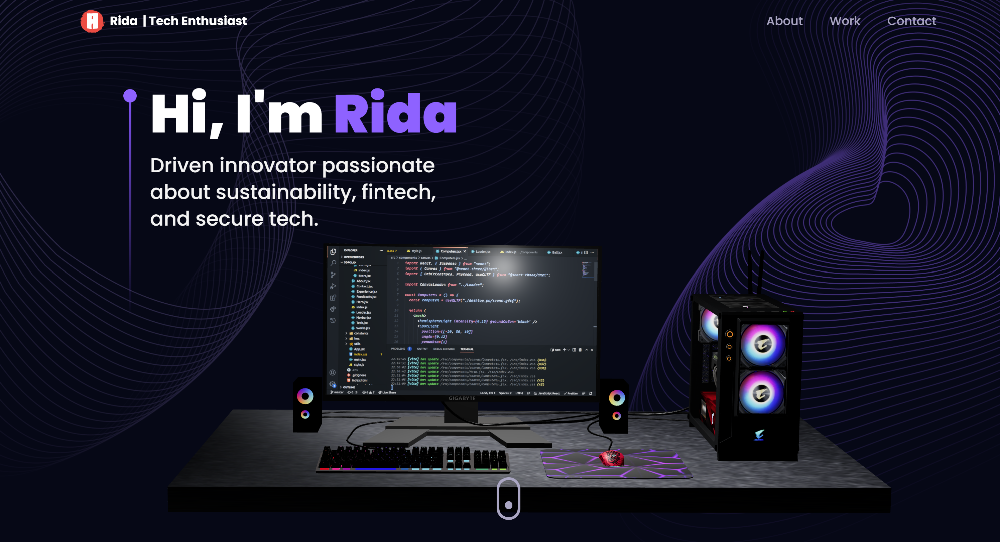

# 🌐 RidaM_Portfolio

An interactive 3D developer and designer portfolio showcasing my **projects, skills, and professional experience** in cybersecurity, UX engineering, and full-stack development.  
Built with **React, TailwindCSS, and Three.js**, the portfolio highlights hackathon work, data science experiments, and industry placements through an engaging, responsive design.

---

## 🚀 Features

- 🎨 Modern 3D design with animations (Three.js, Framer Motion).
- 📂 Project showcase with descriptions, tags, and GitHub links.
- 📱 Fully responsive for desktop and mobile.
- 🧑‍💻 Interactive About, Work, and Contact sections.
- ⚡ Fast build using Vite.

---

## 🛠 Tech Stack

- **Frontend**: React, TailwindCSS, Three.js, Framer Motion
- **Build Tool**: Vite
- **Deployment**: Vercel

---

## 📸 Preview

## 

## ▶️ Getting Started

1. Clone the repository:
   ```bash
   git clone https://github.com/rida05432/RidaM_Portfolio.git
   cd RidaM_Portfolio
   ```
